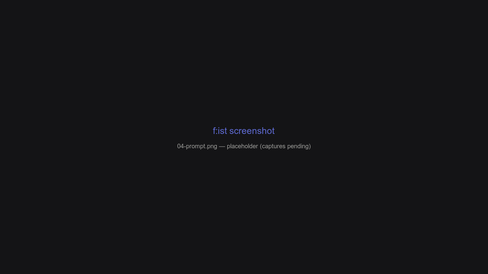

# Navigation, in depth

Navigation in f:ist is a few composable concepts: the **pane stack** (undo/redo), **advance** vs **parent**, the **query bar** and **prompt locking**. Understanding these makes every other feature fall into place.

## Overview

- **Advance** enters the current item; **parent** goes up.
- Every move is recorded on a **pane stack**, so `ctrl-z` undoes navigation itself, not just the cursor.
- The **query bar** filters the listing — or, when the prompt is locked, acts as an input.
- **Visibility** and **sort** are per-pane state you control with four keys.

## Advance and parent

| Action | Keys | Effect |
| --- | --- | --- |
| **Advance** | `→` or `Enter` | Enter a directory; open a file; enter an archive |
| **Parent** | `←` | Go up one level |

Advance decides what to do from the item:

- **Directory** → new Nav pane at that directory.
- **Archive** → transparent extraction navigation (below).
- **Any other file** → run `interface.advance_command` (default `fs :tool lessfilter edit {}`) — the lessfilter **edit** preset decides the program: your `$EDITOR` for text, the system opener for documents, an image viewer for pictures.

### Browsing archives transparently

Advancing into an archive treats it like a directory — no extraction step, no intermediate prompt:

1. The archive's contents appear immediately (the directory tree).
2. Full extraction happens **in the background**, and the pane fills in as files land.
3. `Undo` (`ctrl-z`) pops straight back out. Re-entering the same archive is instant — nothing is re-extracted — and everything is cleaned up when you exit.

Supported formats: **zip, tar, tar.gz, tar.xz, tar.bz2, tar.zst, ar, rar** and **7z**.

## The pane stack

Every pane you visit is pushed onto a stack:

| Keys | Action |
| --- | --- |
| `ctrl-z` | Undo — pop back through pane history |
| `ctrl-shift-z` / `alt-z` | Redo — walk forward again |

The stack includes entering/leaving directories, launching find/search/history/apps/stash panes, and entering an extracted archive (see above). It's the panic button: wherever you end up, undo brings you back.

## The query bar (prompt)

The query bar filters the current pane by fuzzy matching:

- Type to filter; `Esc` or `alt-u` clears.
- In the bar, `←` / `→` move the cursor (character movement is on `shift-←` / `shift-→` by default).
- Pressing `Up` from the first row enters the **prompt** — the cursor locks onto the current directory and the query becomes an input rather than a filter.

### Prompt locking

**Prompt locking** is the default on the query-driven panes: Find and Search both ship with `lock_prompt = true`. When you press `ctrl-r` or `ctrl-f` you expect to be typing a query — a locked prompt makes that true. The query bar becomes an input (an rg/fd pattern, a path to jump to, a history query) instead of a fuzzy filter over the current listing, so your keystrokes are never consumed interpreting results.

Locking does **not** take arrow-key navigation away. While the prompt is active you can still browse the results with `↑`/`↓` — the first press leaves the prompt and moves the cursor — and `←`/`→` edit the query. That's the comfortable default: arrows move you, letters query.

| Mode | Query means | Typical use |
| --- | --- | --- |
| **Locked** (prompt active) | an input | type an rg/fd pattern, a path, a history query |
| **Unlocked** (cursor active) | a filter | narrow the listed results while browsing |

Three knobs, in precedence order:

1. `interface.prompt_locking` — the master switch. When `false`, toggling the prompt and per-pane `lock_prompt` no-op; only pressing `↑` from the first row still enters the cwd lock.
2. Per-pane `lock_prompt` under `[panes.*]` — the Find and Search panes ship with `lock_prompt = true` so `ctrl-f` / `ctrl-r` drop you straight into typing.
3. `alt-space` toggles the prompt at any time; `--lock-prompt <true|false>` overrides it per invocation.

While the prompt is active, the preview hides when `hide_preview_when_cursor_disabled` is set.

## Visibility and sort

| Keys | Action |
| --- | --- |
| `ctrl-s` | Toggle hidden files |
| `ctrl-d` | Toggle "only directories" (in History/Apps panes: cycle sort instead) |
| `ctrl-p` | Options overlay: visibility, sort, search context |

New panes inherit sensible defaults per pane type; `apply_default_sort` re-applies each pane's default sort when you switch to it.

## How navigation feeds history

Navigation isn't just UI state — it feeds the database:

- entering a directory (Advance, `z`, `--cd`, the shell chpwd hook) **bumps** that directory,
- opening a file (Advance on a file, `fs :open`, tracked lessfilter presets) **bumps** that file.

Bumps are score adjustments in the [event-clock model](07-history-database.md) that power `ctrl-g`, `fs :dir`, and the `z` function.

## Pane-specific notes

- **Search panes** keep match context when you navigate: advancing on a hit exports `HIGHLIGHT_LINE` / `HIGHLIGHT_COLUMN` so the editor opens at the match (see [The search pane](06-search-pane.md)).
- **Custom panes** run their command with the pane's cwd as working directory; re-advancing re-runs the filter.
- **Stash panes** are lists, not directories — `←` returns to the previous pane and entries survive navigation.

## Autojump

For power users: `ctrl-1` … `ctrl-9` jump to and accept row 1–9 directly, and `ctrl-0` toggles the query bar. `autojump_advance` switches autojump from accepting to advancing. Most users don't need it; the arrow keys plus `?` cover the same ground.

## FAQ

**How do I get back after a long dive?**

`ctrl-z` walks the pane stack backward — every pane you've visited is one undo away. `ctrl-shift-z` / `alt-z` walk forward again.

**Why did `Enter` open a file instead of entering a directory?**

Advance is context-aware: a directory becomes a new Nav pane, an archive becomes its contents, and any other file runs the configured `interface.advance_command` (default: `fs :tool lessfilter edit {}`). Change that command to rewire "open" behavior.

**What does prompt locking actually change?**

Locked, your keystrokes go into the query instead of filtering the listing — so on Find and Search, pressing `ctrl-r` / `ctrl-f` drops you straight into typing the pattern, and arrow keys still move you through results. Unlocked, the query bar becomes a fuzzy filter over the current listing. `alt-space` toggles the mode at any time; `interface.prompt_locking` is the master switch.

[← Previous: Panes](03-panes.md) · [Next: The find pane (`fd`) →](05-find-pane.md)
