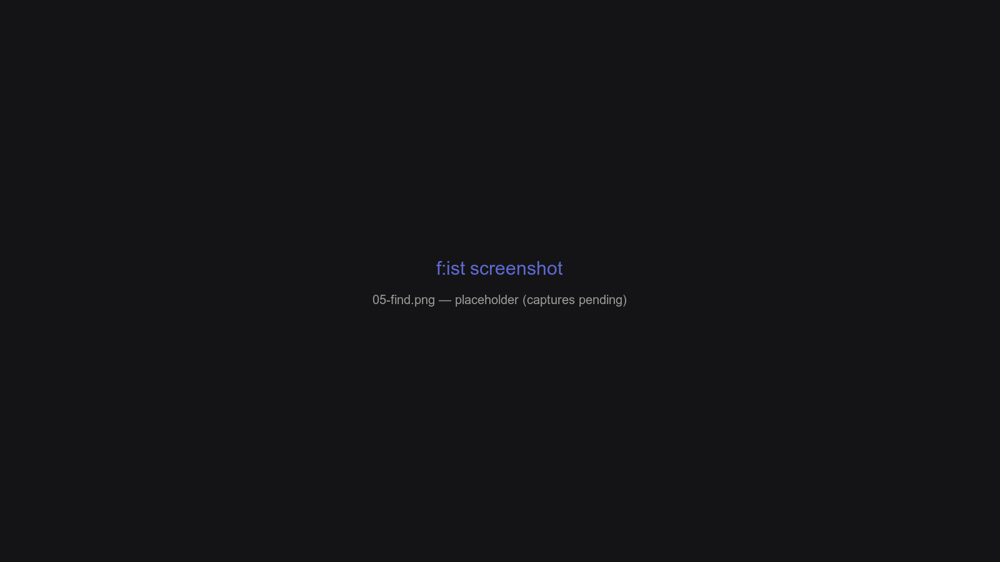

# The find pane (`fd`)

The **Find** pane searches files recursively, backed by `fd` — fast, git-aware, and predictable. Results are ordinary panes: filterable, sortable, previewable, queueable.



## Overview

- The **last** positional argument is the query; earlier ones are paths.
- Visibility has three modes (hidden / ignore / all) plus automatic handling of dotfile queries.
- `-t` is overloaded: file types, extensions, and built-in or custom categories.

## Opening a find

| Way | Command |
| --- | --- |
| In-app | `ctrl-f` (search the current directory) |
| Subcommand | `fs :fd` (alias `::`) |
| Bare `fs` | `fs pattern`, `fs path pattern`, `fs path1 path2 pattern` |

```shell
fs src main.rs                    # "main.rs" under ./src
fs -t d . -- --max-depth 1        # directories, one level deep
fs -t d --list ~/notes .          # non-interactive (see below)
```

Everything after `--` is passed to `fd` verbatim.

## Flags

| Flag | Meaning |
| --- | --- |
| `-h` / `-I` / `-a` | Show hidden / hide ignored / show all |
| `-A`, `--no-all` | Clear the "all" visibility |
| `-F` / `-f` | Only directories / only files |
| `-t, --types` | Restrict by type, extension, or category |
| `--sort <sort>` | `name` `mtime` `atime` `size` `none` |
| `--transform <lua>` | Rewrite each entry `(path, tail) → (path, display, tail)` |
| `--list` | Print results instead of launching the TUI |
| `--cd` | `cd` to the best match — the backend for the `z` shell function (with keywords, prints the database's best match and exits) |
| `--reset-visibility` | Ignore any configured default visibility |

## Types (`-t`)

| Form | Example | Matches |
| --- | --- | --- |
| File type | `-t d`, `-t x` | `f` file, `d` dir, `l` symlink, `b`/`c` devices, `x` executable, `e` empty, `s` socket, `p` pipe |
| Extension | `-t .rs`, `-t .tar.gz` | Files with that extension (multi-part works) |
| Built-in category | `-t image`, `-t source` | See `fs :tool types` for the full catalog |
| Custom category | `-t raster` | Defined in `lessfilter.toml` (see below) |

Single letters that collide with a file type resolve to the file type (`-t b` is a block device, not "build"). Categories and extensions compose: `fs -t image,.rs,d`.

### Custom categories

`[categories]` in `lessfilter.toml` maps a name to MIME strings:

```toml
[categories]
raster = ["image/png", "image/jpeg"]
```

`fs -t raster …` then works everywhere a built-in category does.

## Visibility

Visibility is a small state machine, toggled in-app with `ctrl-s` (hidden) and `ctrl-d` (dirs only), and set per command:

| Mode | Meaning |
| --- | --- |
| default | Hidden files off; git-ignored files hidden inside repos, shown outside them |
| `hidden` (`-h`, `ctrl-s`) | Show dotfiles |
| `ignore` (`-I`) | Hide git-ignored files |
| `all` (`-a`) | Show everything (`--hidden --no-ignore`) |

Queries that start with `.` (like `.git`) automatically enable hidden files, and a directory containing only hidden files reveals them. Both are controlled by `fd.dot_query_show_hidden` (`Auto` / `Always` / `Never`).

## fd configuration (`[fd]` in config.toml)

| Setting | Default | Meaning |
| --- | --- | --- |
| `dot_query_show_hidden` | `Auto` | Show hidden for `.`-queries |
| `default_search_in_home` | `false` | Search `$HOME` when only a pattern is given |
| `default_search_ignore` | `false` | Hide ignored files when only a pattern is given |
| `reduce_paths` | `false` | Chdir to the common prefix of the given paths |
| `default_args` | `[]` | Appended to every fd invocation |
| `base_args` | `[]` | Prepended to every fd invocation |
| `exclusions` | `{}` | Per-directory exclusion globs |

`exclusions` pin per-directory ignore lists; an entry under the empty key `""` replaces the platform defaults everywhere:

```toml
[fd.exclusions]
"~/tmp" = ["node_modules"]
```

## The `--transform` hook

`--transform` runs a Lua function on every row before display:

```lua
return function(path, tail)
  local parent = path:gsub("/%.git$", "")
  if parent ~= path then
    return parent, parent:match("[^/]+$")
  end
  return path, path
end
```

Returning a missing `path` omits the row; missing `display` / `tail` keep the current values. Prefix the argument with `@` to load the script from a file.

Note: transforms are stateless — each row starts clean, so don't rely on state from a previous row.

## Sorting

Sort with `--sort` or the options overlay (`ctrl-p`). The find pane supports `name`, `mtime`, `atime`, `size`, and `none` (insertion order). Size sorting requires metadata, which loads lazily in the background.

## Non-interactive use: `--list`

`fs --list` prints matching paths to stdout (one per line, or `--format` / `--output-sep` styled) and exits:

```shell
fs -t d --list ~/notes . -- --max-depth 1 | while read -r d; do
  echo "vault: $d"
done
```

See [Output & templates](16-output-templates.md) for the `--format` template language.

## FAQ

**Why does `fs .git` show hidden files?**

Queries starting with `.` enable hidden files automatically, so `.git` and friends appear without a `-h`.

**How do I search for files with no extension?**

`-t ''` matches files with no extension.

**What's the difference between `--` and the rest of the arguments?**

Arguments before `--` are interpreted by f:ist (`-t`, `-h`, paths); arguments after it are passed to `fd` raw.

[← Previous: Navigation, in depth](04-navigation-in-depth.md) · [Next: The search pane (`rg`) →](06-search-pane.md)
