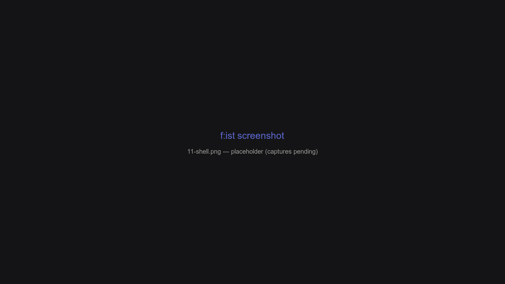

# Shell integration

`fs :tool shell` prints zsh initialization code: a **`z`** jump function (type a folder name, `cd` to your best match), **`zz`** (jump and open), a `chpwd` hook that feeds the history database, and three line-editing **widgets** that browse with f:ist right in your prompt.



## Overview

- `z` jumps: existing directories `cd` directly; keywords resolve through the history database or an interactive picker.
- `zz` jumps *and* opens — the file version of `z`.
- The `chpwd` hook bumps `$PWD` into the database on every `cd`, which is what makes `z` smarter over time.
- Widgets bind `shift-←` / `shift-→` / `shift-↓` to interactive pickers that insert paths into the command line.

## Install

```shell
echo '\neval "$(fs :tool shell)"' >> ~/.zshrc
```

The full integration is zsh; other shells still get the plain `z`/`zz` functions (use `--shell <name>` to request them).

## `z` — jump

```shell
z docs          # cd to the best "docs" match from history
z ~/code        # direct cd — the arg is an existing directory
z .             # interactive: pick a directory under the current one
z ./            # interactive: browse the current directory (all files)
z               # interactive: recent-folders picker
```

The last argument decides the behavior:

| Trailing arg | Command run | Result |
| --- | --- | --- |
| an existing directory | — | `cd` directly |
| `.` or `..` | `fs :: -F --style=colors --cd -- …` | Interactive picker of directories (find pane, dirs only) |
| `./` | `fs :: -a --cd -- …` | Nav pane at the current directory |
| anything else | `fs :dir --sort atime --style=colors --lock-prompt=false --cd -- …` | Best match from the database, printed + `cd`; no match falls back to the interactive `fs :dir` picker |

The picked path is printed by f:ist (`alt-accept` prints instead of opening) and piped back into `cd`.

## `zz` — jump and open

```shell
zz report.md    # open the file (lessfilter edit preset)
zz notes        # jump to the best "notes" match, then open it
zz              # bump the current dir and open it
```

The open command is `fs :tool lessfilter edit` by default — point it at a file (via `paths`), and the preset picks the program (`$EDITOR` for text, etc.). Widgets and the `--opener` flag use the same command.

## Feeding the database

Every directory you `cd` into is recorded in the history database (a `chpwd` hook runs `fs :tool bump "$PWD"` for you). Combined with the event-clock scoring (see [History & the database](07-history-database.md)), the folders you visit regularly become the fastest to jump to.


## Widgets

Three line-editing widgets run f:ist from the prompt and insert the result into the current line:

| Bind | Behavior |
| --- | --- |
| `shift-←` | Browse a directory to `cd` into — or a file, inserting its name for you |
| `shift-→` | Pick a file and append it (quoted) to the current line |
| `shift-↓` | Full-text search and append the matching lines |

Each widget leaves the prompt alone until you pick something; the inserted paths are shell-quoted.

## `--aliases`

`fs :tool shell --aliases` appends a block of convenience wrappers (the nav function's name is configurable via `--nav-name`, default `Z`):

```shell
l  file          # fs :tool lessfilter display   — rich terminal preview
la file          # fs :tool lessfilter extended
ll file          # fs :tool lessfilter info      — metadata
n  file          # edit via lessfilter edit ($EDITOR fallback: nano)
o  files…        # fs :o — open with the system handler, record history
Z  keyword       # FS_VERBOSITY=1 z "$@" ./      — navigate + jump
zf               # fs :file --sort atime --lock-prompt=false — recent files
lessfilter / lz / tra   # direct wrappers for the :tool subcommands
```

## Customizing the output

Every embedded default is a flag on `fs :tool shell`:

| Flag | Default | Meaning |
| --- | --- | --- |
| `--z-name` | `z` | Jump function name |
| `--z-dot-args` | `-F --style=colors` | Args for the `.`/`..` picker |
| `--z-slash-args` | `-a` | Args for the `./` picker |
| `--z-dir-args` | `--sort atime --style=colors --lock-prompt=false` | Args for the keyword jump |
| `--open-name` | `zz` | Open function name |
| `--open-cmd` | `fs :tool lessfilter edit` | Open command (`{}` = the picked path) |
| `--file-open-cmd` / `--rg-open-cmd` | `--open-cmd` | Per-widget open commands |
| `--dir-widget-bind` / `--file-widget-bind` / `--rg-widget-bind` | `^[[1;2D` / `^[[1;2C` / `^[[1;2B` | Widget key sequences |
| `--dir-widget-args` / `--file-widget-args` / `--rg-widget-args` | see Widgets | Per-widget picker args |
| `--aliases` | `false` | Append the alias block |
| `--nav-name` | `Z` | Name of the `--aliases` nav function |
| `--shell` | auto | Filter the output for this shell tag |

The `FS_INITIAL_INPUT` environment variable pre-fills the keyword picker's query — the `Z` alias uses it to pass your typed keywords through.

## FAQ

**Why is the shell integration zsh-only?**

The widget and hook integration is zsh-specific (it hooks into zsh's line editor). The `z`/`zz` functions themselves are plain shell and work elsewhere via `--shell <name>`.

**Does `z` work without the database?**

Yes — existing directories `cd` directly, and the `.`/`./` pickers use `fd`, not history.

**Can I use a different opener than `lessfilter edit`?**

`--open-cmd 'code --add {}'` or `--file-open-cmd` / `--rg-open-cmd` for the widgets.

[← Previous: Configuration](10-configuration.md) · [Next: Previewing with lessfilter →](12-lessfilter.md)
