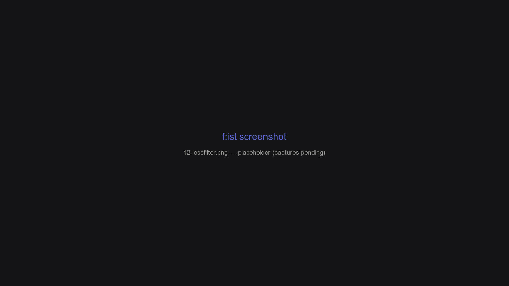

# Previewing with lessfilter

**lessfilter** is f:ist's context-aware file handler: it turns a path into a *command* based on its content and the context you're in. Previews, metadata panes, "edit", "open" — all of them go through lessfilter presets.



## Overview

- A **preset** picks a task (preview, info, edit, open, …); rules then pick a command for the specific file.
- Rules are scored **glob → extension → mime → category** with modifiers, in `lessfilter.toml`.
- Everything is configurable — presets, rules, built-in behaviors, and your own commands.

## Presets

| Preset | Alias | Used by | Typical output |
| --- | --- | --- | --- |
| `display` | `d` | `l` alias, `alt-shift-i` | Rich terminal output (pager for text, chafa for images) |
| `preview` | `p` | `?`, the preview pane | Same, in the preview split |
| `extended` | `x` | `la` alias, `alt-l` | Paged, interactive (header + content) |
| `info` | `i` | `ll` alias, `alt-i` / `alt-/` | Metadata (mediainfo for media, `liza :l` + metadata otherwise) |
| `edit` | `e` | `Enter` (advance), `alt-n` | Open in your editor (`$EDITOR`, line/column aware) |
| `open` | `o` | `ctrl-enter`, `alt-o`, `zz` | Open with the system handler (`fs :open`) |
| `alternate` | — | `alt-8` | Free preset — your own rules |
| `alternate2` | — | (unbound) | Free preset |
| `default` | (config only) | Config-time resolution | Not invocable from the CLI |

A preset is just a *set of rules*: `fs :tool lessfilter <preset> <path>` runs the winner's command.

## How a file gets its command

For each rule in the preset's order, lessfilter computes a **score** from the file's attributes (path, extension, MIME type, children, permissions, git status):

| Rule | Matches |
| --- | --- |
| `glob:*.rs` | Full path against a glob |
| `child:src` | Any child of the path (or its parent) matches the glob |
| `mime:image/png` | MIME type (wildcards allowed) |
| `ext:rs` | Extension |
| `cat:image` | File category (built-in or your `[categories]`) |
| `have:prog` | Program on `PATH` (inverted: `!have:x`) |
| `type:f` / `type:d` / `type:l` / `type:x` / `type:text` | File kind; `type:text` covers UTF-8/16 |
| `application` | Platform app bundle / launcher / executable |
| `git` | Inside a git work tree |
| `*` | Anything |

Scores are written as `modifier|rule`; the modifiers are **Add / Sub / Max / Min / Req** (255 = always wins):

| Shorthand | Meaning |
| --- | --- |
| `+2 | glob:x` | Add 2 |
| `-1 | ext:log` | Subtract 1 |
| `>5 | mime:image/*` | Max 5 (also bare `5 | rule` — Max) |
| `<3 | cat:doc` | Min 3 |
| `^ | have:prog` | Require |

The best-scoring rule wins; ties go to the earlier rule; score 0 doesn't count. The shipped defaults encode the priority — e.g. `glob` scores 50, `ext` 30, `mime`/`cat` 20, `have`/`type`/`git` are requirements, `application` 60.

## Built-in actions

| Action | Behavior |
| --- | --- |
| `Text` | Pager for text (preview/display); header + metadata in extended |
| `Image` | `chafa` (symbols or sixels), sized to the preview |
| `Directory` | `liza` — an eza-based directory listing (`:u2` preview, `:u` display, `::nav :a` extended, `:sba` info) |
| `Application` | App icon via the image viewer |
| `Metadata` | Metadata dump (mediainfo for media) |
| `Extract` | Extract hint for documents |
| `Open` | Defer to the system opener (`fs :open`) |
| `Header` | Print a styled header line |
| `None` | No output |

The `edit` preset is special: `Text` becomes the editor (below), `Directory` opens `$VISUAL` (or `fs :open`).

## The editor, the visualizer, and their env

`edit` chooses a program in order:

| Role | Order |
| --- | --- |
| Editor | `FS_EDITOR` → `$EDITOR` → `fs :open` (fallback `nano`) |
| Visual (directories) | `FS_VISUAL` → `$VISUAL` → `fs :open` |
| Image viewer | `run.image_viewer` setting |

Line/column placement works for `micro` (`path:line`), `vim`/`nvim` (`+line`), and `nano` (`+line,col`) — fed from the `HIGHLIGHT_LINE` / `HIGHLIGHT_COLUMN` variables f:ist exports when you advance on a [search hit](06-search-pane.md). The same variables let the previewer jump to the matching line.

## Custom commands and categories

`[actions]` in `lessfilter.toml` defines named shell commands; `{}` is replaced by the file path:

```toml
[actions]
code = 'code --add {}'
rainfrog = 'rainfrog {}'
```

Use them in rules via the `Cat` rule or by assigning them as the preset's action. `[categories]` maps a name to MIME strings — usable by `-t` on the command line and by `cat:` rules:

```toml
[categories]
raster = ["image/png", "image/jpeg"]
```

Action names are case-insensitive; a rule referencing an unknown one becomes a *custom action* — keep the names aligned with `[actions]`.

## Text rendering

Long text is rendered through a pager so it stays scrollable. Override the pager command with the `FS_PAGER` environment variable (e.g. `FS_PAGER=moar fs …`); the bundled default is bat-based.

## CLI and debugging

```shell
fs :tool lessfilter edit file.md      # run the edit preset
fs :tool lessfilter display -- -t d . # liza-style directory listing
fs :tool lessfilter info --diagnose photo.png   # show the winning rule and command
fs :tool lessfilter --no-exec preview file.md   # print the command only
```

- `--diagnose` prints the detected file data, the winning rule with its score, and the commands that would run — without executing. Run the *tracked* presets (`edit`, `alternate`, `extended`) also bumps the file's history entry; `--diagnose` skips that.
- `--header true/false` forces the header; `--tty` forces terminal output.
- `--arg` passes arguments to the first executed command.

## FAQ

**How do I preview a new file type?**

Add a rule to the preset in `lessfilter.toml`, e.g. `[[preview.rules]] patterns = ["ext:md"] actions = ["Text"]` — or a custom action. Check it with `--diagnose`.

**Why does `fs :tool lessfilter default` not work?**

`default` is the config-time preset (what the app resolves against) and isn't invocable from the CLI.

**Where do `HIGHLIGHT_LINE` and friends come from?**

The app sets them when you advance on a search match; the edit preset uses them to open at the right line. See [The search pane](06-search-pane.md).

[← Previous: Shell integration](11-shell-integration.md) · [Next: Menu actions →](13-menu-actions.md)
