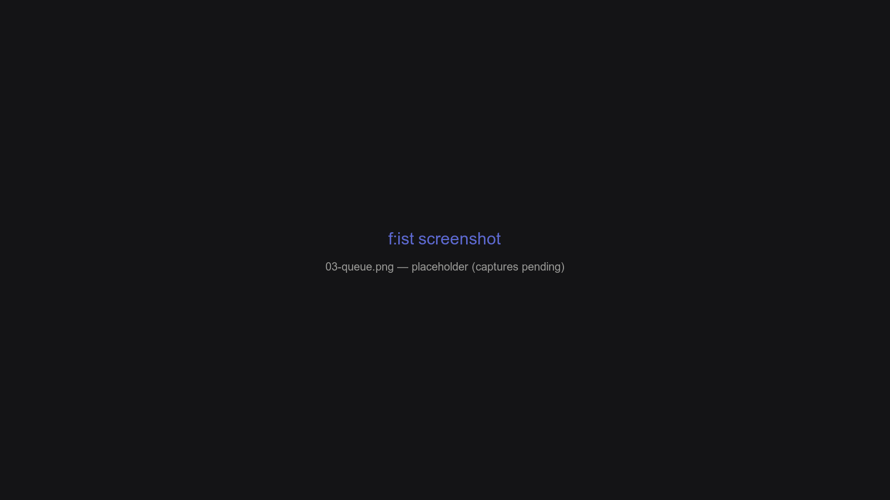

# Core workflows

One loop covers everything in f:ist: **filter → inspect → act → undo**. Every action is one or two keys away, and undo is always the escape hatch.

## Overview

- **Filter** the current listing by typing; `ctrl-f` / `ctrl-r` / `ctrl-g` switch to find, full-text, and history panes.
- **Inspect** with `?` (preview) and `alt-i` (info) without opening anything.
- **Act** on the cursor row or a multi-row selection.
- **Undo** (`ctrl-z`) walks back through your pane history — you can't get lost.

## Select multiple items

| Keys | Action |
| --- | --- |
| `tab` | Toggle selection on the current row (and move down) |
| `ctrl-a` | Cycle through selections |
| `ctrl-shift-a` | Clear all selections |
| `ctrl-e` | Menu of actions for the selection (or cursor, or cwd) |

The **menu** (`ctrl-e`) shows the actions that make sense for what you have selected — `New`, `Rename`, `Cut`, `Copy`, `Trash`, `Open With`, plus your [custom actions](menu-actions.md). Type the highlighted letter (or an alias like `C`) to trigger one.

## Cut, copy, and paste

File transfer is a two-step dance backed by an **operation queue**:

1. `ctrl-x` (cut) or `ctrl-c` (copy) on a file or selection.
2. Navigate to the destination directory.
3. `ctrl-v` to **paste** everything queued.



`ctrl-u` opens the queue overlay at any time. Each row shows **kind · source · destination · progress**:

| Keys | Row action |
| --- | --- |
| `↑` / `↓` | Move |
| `space` | Select rows |
| `shift-↑` / `shift-↓` | Reorder rows |
| `ctrl-e` | Edit the source |
| `ctrl-shift-r` | Edit the destination |
| `Enter` | Execute the row |
| `delete` | Remove the row |

The queue is *destination-lazy*: destinations resolve against the directory you're in **at paste time**, not at copy time. For the full semantics — queue kinds, selectors, and progress — see [The queue](queue.md).

Note: the queue lives in memory for the run. For mission-critical transfers, prefer a [custom menu action](menu-actions.md) that performs the transfer itself.

## Search

Three panes answer "where is it?":

| Pane | Shortcut | Backend | Use for |
| --- | --- | --- | --- |
| **Find** | `ctrl-f` | `fd` | Recursive filename search — [see docs](find-pane.md) |
| **Search** | `ctrl-r` | `ripgrep` | Full-text content search — [see docs](search-pane.md) |
| **History** | `ctrl-g` | SQLite | Recently visited folders & files — [see docs](history-database.md) |

Search results are ordinary panes: preview, edit, queue, trash, and open-with all work on them.

## Preview

| Keys | Action |
| --- | --- |
| `?` | Preview (quick look) |
| `alt-i` / `alt-/` | Info preview (metadata) |
| `alt-shift-i` | Display preview (richer output) |
| `ctrl-l` | Preview paged through the terminal pager |
| `alt-l` | Extended preview, paged & interactive |
| `alt-n` | Edit the current file |
| `ctrl-enter` / `alt-o` | Open with the system handler |

Every key above is a [lessfilter](lessfilter.md) preset — you can redefine any of it.

## Other everyday actions

| Keys | Action |
| --- | --- |
| `ctrl-y` | Copy the full path of the item |
| `ctrl-shift-r` | Rename |
| `alt-r` | Reload the current listing |
| `ctrl-s` | Toggle hidden files |
| `ctrl-d` | Toggle "only directories" |
| `ctrl-p` | Options overlay: visibility, sort order, search context |
| `alt-u` | Clear the query |
| `ctrl-esc` | Drop to a shell in the current directory |

## Example: a real task

```shell
fs -t .md ~/notes          # list all markdown under ~/notes
ctrl-r "meeting"           # full-text search for "meeting"
tab                        # select the interesting hit
ctrl-e → R                 # rename it
alt-n                      # open it in your editor
ctrl-z                     # undo the pane walk — back to where you were
ctrl-v                     # paste earlier queued copies into the current dir
```

## FAQ

**How do I move files between directories?**

`ctrl-x` on the file, navigate to the destination, `ctrl-v`. The queue shows the pending cut with `ctrl-u`.

**Is there a way to delete without the trash?**

`shift-delete` deletes permanently (no trash). `delete` moves to the OS trash.

**Can I run an action on many files at once?**

Select rows with `tab`, then `ctrl-e` — the menu targets the whole selection. Custom actions receive the full path list (see [Menu actions](menu-actions.md)).
