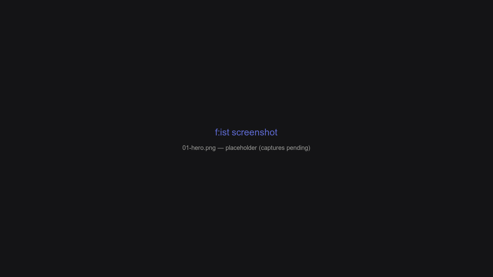

  

    <svg width="12" height="12" viewBox="0 0 24 24" fill="none" stroke="currentColor" stroke-width="2" stroke-linecap="round" stroke-linejoin="round"><path d="M12 2v20M17 5H9.5a3.5 3.5 0 0 0 0 7h5a3.5 3.5 0 0 1 0 7H6"/></svg>
    Documentation
  

  <h1 class="linear-hero-title">f:ist Documentation</h1>
  

    <strong>F:ist</strong> (<strong>F</strong>ist: <strong>I</strong>nteractive <strong>S</strong>earch <strong>T</strong>ool) is a fast, keyboard-first browser and launcher for your filesystem. It wraps <code>fd</code>, <code>ripgrep</code>, <code>eza</code>, and a zoxide-style jump database in one cohesive, extensible terminal interface.
  

  

    <a href="./01-getting-started" class="linear-chip">
      <svg viewBox="0 0 24 24" fill="none" stroke="currentColor" stroke-width="2"><polyline points="13 17 18 12 13 7"/><polyline points="6 17 11 12 6 7"/></svg>
      Quick start
    </a>
    <a href="./02-core-workflows" class="linear-chip">
      <svg viewBox="0 0 24 24" fill="none" stroke="currentColor" stroke-width="2"><circle cx="12" cy="12" r="10"/><polyline points="12 6 12 12 16 14"/></svg>
      Core workflows
    </a>
    <a href="./03-panes" class="linear-chip">
      <svg viewBox="0 0 24 24" fill="none" stroke="currentColor" stroke-width="2"><rect x="3" y="3" width="18" height="18" rx="2" ry="2"/><line x1="3" y1="9" x2="21" y2="9"/><line x1="9" y1="21" x2="9" y2="9"/></svg>
      Explore panes
    </a>
    <a href="./13-menu-actions" class="linear-chip">
      <svg viewBox="0 0 24 24" fill="none" stroke="currentColor" stroke-width="2"><path d="M14 2H6a2 2 0 0 0-2 2v16a2 2 0 0 0 2 2h12a2 2 0 0 0 2-2V8z"/><polyline points="14 2 14 8 20 8"/></svg>
      Menu actions
    </a>
  

  

    <svg width="18" height="18" viewBox="0 0 24 24" fill="none" stroke="currentColor" stroke-width="2" stroke-linecap="round" stroke-linejoin="round"><circle cx="12" cy="12" r="10"/><line x1="12" y1="16" x2="12" y2="12"/><line x1="12" y1="8" x2="12.01" y2="8"/></svg>
  

  

    <strong>Apology for this documentation.</strong> These pages are an AI-drafted, incomplete scaffold — the prose will be rewritten by hand later.
  

## Browse by topic

  

    

      

        <svg viewBox="0 0 24 24" fill="none" stroke="currentColor" stroke-width="2" stroke-linecap="round" stroke-linejoin="round"><polygon points="13 2 3 14 12 14 11 22 21 10 12 10 13 2"/></svg>
      

      <h3 class="linear-section-title">Getting started</h3>
    

    
Get up and running with installation, first launch, and core navigation.

    <ul class="linear-link-list">
      <li class="linear-link-item">
        <a href="./01-getting-started">
          01 – Getting started
          →
        </a>
      </li>
      <li class="linear-link-item">
        <a href="./02-core-workflows">
          02 – Core workflows
          →
        </a>
      </li>
    </ul>
  

  

    

      

        <svg viewBox="0 0 24 24" fill="none" stroke="currentColor" stroke-width="2" stroke-linecap="round" stroke-linejoin="round"><rect x="3" y="3" width="18" height="18" rx="2" ry="2"/><line x1="3" y1="9" x2="21" y2="9"/><line x1="9" y1="21" x2="9" y2="9"/></svg>
      

      <h3 class="linear-section-title">Panes & Navigation</h3>
    

    
Understand the pane stack model, fuzzy filtering, and search backends.

    <ul class="linear-link-list">
      <li class="linear-link-item">
        <a href="./03-panes">
          03 – Panes overview
          →
        </a>
      </li>
      <li class="linear-link-item">
        <a href="./04-navigation-in-depth">
          04 – Navigation, in depth
          →
        </a>
      </li>
      <li class="linear-link-item">
        <a href="./05-find-pane">
          05 – The find pane (<code>fd</code>)
          →
        </a>
      </li>
      <li class="linear-link-item">
        <a href="./06-search-pane">
          06 – The search pane (<code>rg</code>)
          →
        </a>
      </li>
      <li class="linear-link-item">
        <a href="./07-history-database">
          07 – History & database
          →
        </a>
      </li>
      <li class="linear-link-item">
        <a href="./08-stash-panes">
          08 – Stash panes
          →
        </a>
      </li>
      <li class="linear-link-item">
        <a href="./09-queue">
          09 – The queue
          →
        </a>
      </li>
    </ul>
  

  

    

      

        <svg viewBox="0 0 24 24" fill="none" stroke="currentColor" stroke-width="2" stroke-linecap="round" stroke-linejoin="round"><polyline points="4 17 10 11 4 5"/><line x1="12" y1="19" x2="20" y2="19"/></svg>
      

      <h3 class="linear-section-title">Mechanics & Extensibility</h3>
    

    
Shell hooks, preview rendering with lessfilter, and custom Lua actions.

    <ul class="linear-link-list">
      <li class="linear-link-item">
        <a href="./10-configuration">
          10 – Configuration
          →
        </a>
      </li>
      <li class="linear-link-item">
        <a href="./11-shell-integration">
          11 – Shell integration
          →
        </a>
      </li>
      <li class="linear-link-item">
        <a href="./12-lessfilter">
          12 – Previewing with lessfilter
          →
        </a>
      </li>
      <li class="linear-link-item">
        <a href="./13-menu-actions">
          13 – Menu actions
          →
        </a>
      </li>
      <li class="linear-link-item">
        <a href="./14-command-line">
          14 – Command line
          →
        </a>
      </li>
      <li class="linear-link-item">
        <a href="./15-tools">
          15 – Tools (<code>fs :tool</code>)
          →
        </a>
      </li>
      <li class="linear-link-item">
        <a href="./16-output-templates">
          16 – Output & templates
          →
        </a>
      </li>
    </ul>
  

## The mental model

Everything in f:ist happens inside a **pane** — a filterable, sortable, previewable list of paths — and the **stack** of panes you've visited:

- The **Nav** pane browses a directory.
- **Find**, **Search**, **History**, **Apps**, **Stash** and **Custom** panes produce lists from different sources (`fd`, `ripgrep`, the history database, your app registry, a stash, or any command's output).
- `Undo` / `Redo` (<kbd>ctrl-z</kbd> / <kbd>ctrl-shift-z</kbd>) walk back and forth through your pane history. There is no way to get lost.
- The **queue** holds pending file operations (copy/cut/paste).
- The **menu** (<kbd>ctrl-e</kbd>) exposes context-aware actions for the current selection.

You rarely switch "modes". Instead you *filter what you see* (type to fuzzy-match, <kbd>ctrl-s</kbd> to show hidden files, <kbd>ctrl-d</kbd> to show only directories) and *act* on the result with one or two keys.

## Quick keybinding cheat sheet

| Shortcut | Action | Scope |
| --- | --- | --- |
| <kbd>Enter</kbd> | Accept item (cd directory / open file) | Everywhere |
| <kbd>ctrl-f</kbd> | Open Find pane (`fd` recursive filename search) | Everywhere |
| <kbd>ctrl-r</kbd> | Open Search pane (`rg` full-text search) | Everywhere |
| <kbd>ctrl-g</kbd> | Open History pane (recents database) | Everywhere |
| <kbd>ctrl-e</kbd> | Open Context Menu (actions & tools) | Everywhere |
| <kbd>ctrl-z</kbd> / <kbd>ctrl-shift-z</kbd> | Undo / Redo pane navigation | Everywhere |
| <kbd>?</kbd> | Toggle file preview | Everywhere |
| <kbd>alt-h</kbd> | In-app keybinding help | Everywhere |

  

    <svg width="20" height="20" viewBox="0 0 24 24" fill="none" stroke="currentColor" stroke-width="2"><circle cx="12" cy="12" r="10"/><line x1="12" y1="16" x2="12" y2="12"/><line x1="12" y1="8" x2="12.01" y2="8"/></svg>
  

  

    <strong>Need full reference?</strong> Run <code>fs :tool show-binds</code> from your shell or check the <a href="./13-menu-actions">menu actions</a> chapter for Lua action schemas.
  

