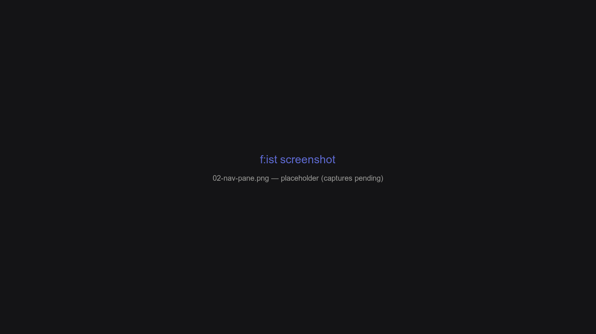

# Panes

A **pane** is a filterable, sortable, previewable list of paths. Every feature in f:ist is a pane — the only difference is where the list comes from.

## Overview

| Pane | Source | Open it | Sortable | Visibility |
| --- | --- | --- | --- | --- |
| [Nav](#nav) | A directory on disk | `fs`, `←` / `→` | [Yes](sorting.md) | [Yes](visibility.md) |
| [Find](#find--fd) | Recursive search (`fd`) | `ctrl-f`, `fs :fd` | [Yes](sorting.md) | [Yes](visibility.md) |
| [Search](#search--rg) | Full-text matches (`ripgrep`) | `ctrl-r`, `fs :rg` | [Yes, no size](sorting.md#per-pane-notes) | [Yes](visibility.md) |
| [Files / Folders](#files--folders) | Visit history (SQLite) | `ctrl-g`, `fs :file` | [db sorts](sorting.md#per-pane-notes) | — |
| [Apps](#apps) | Installed applications | `fs :open`, **Open With** | [db sorts](sorting.md#per-pane-notes) | — |
| [Stash](#stash) | A named stash (db or memory) | `alt-shift-s`, `alt-shift-b` | [Yes](sorting.md) | — |
| [Custom](#custom--stream) | A command's output / stdin | `fs :custom` | [Yes](sorting.md) | [Yes](visibility.md) |

Sorting and visibility are covered in depth on their own pages: [Sorting](sorting.md) and [Visibility](visibility.md).

Panes are interchangeable once open: preview, filtering, sorting, selection, file actions, and undo/redo behave identically everywhere.

## Nav

The directory browser — the pane you start in and the one you return to.

- `Enter` accepts: directories `cd` in, files open via the [lessfilter](lessfilter.md) **edit** preset.
- `←` / `→` go to parent / advance into the selection.
- Sorted by **mtime** by default, configurable through `panes.nav.default_sort` (see [Sorting](sorting.md)).
- Visibility adapts to the directory: dotfiles are shown inside git repositories, and a directory containing only hidden files shows them automatically (see [Visibility](visibility.md)).



## Find (`fd`)

Recursive filename search, backed by `fd`. Results stream in and are immediately filterable, sortable, and previewable.

- `ctrl-f` searches the current directory; `fs pattern` and `fs :fd` from the shell.
- The **last** positional argument is the query (`fs ~/gh tokio` searches for `tokio` under `~/gh`).
- Queries starting with `.` automatically include hidden files.
- `-t` is overloaded: file types (`f`, `d`, `l`, …), extensions (`.rs`), preset categories (`image`, `video`, …), and custom categories. `fs :tool types` prints the full catalog.

See [The find pane (`fd`)](find-pane.md).

## Search (`rg`)

Full-text search of file contents, backed by `ripgrep`. Each result is a file path plus a **context column** with the matching lines.

- `ctrl-r` in-app; `fs :rg` (alias `fs :`) from the shell.
- **Query mode** re-runs ripgrep as you type; **filter mode** narrows already-loaded results. `ctrl-r` toggles.
- `%` switches the filter to the context column.
- Advancing on a match sets `HIGHLIGHT_LINE` / `HIGHLIGHT_COLUMN` so editors open at the match.

See [The search pane (`rg`)](search-pane.md).

## Files / Folders

Your visited paths, drawn from the SQLite database and ranked by recency × frequency — the same ranking the `z` shell function uses.

- `ctrl-g` opens both; `fs :file` / `fs :dir` from the shell.
- Sort by **name / atime / count / frecency** (`n` / `t` / `c` / `f` in the options overlay).
- `fs :dir --cd query` prints the best match and exits — that's what `z` calls.

See [History & the database](history-database.md).

## Apps

Applications installed on your system (`.desktop` files, `.app` bundles). Pick a launch method for a set of files.

- `fs :open` opens the apps pane; `fs :open file.pdf` opens directly.
- `fs :open -w prog files` opens with a specific program.
- In-app: menu → **Open With** (`W`), which preloads the current selection.
- The second column shows the command / alias.

## Stash

Named, cross-session collections of paths. Two families in practice:

- **Scratch** (`alt-s` push / `alt-shift-s` open): the unnamed stash is **transient** by default — in-memory, empty each run. Good for a throwaway working set.
- **Bookmarks** (`alt-b` / `alt-shift-b`): a persistent, db-backed stash. Configure `kind = "prune"` and `insert = "skip"` under `[panes.stashes.bookmark]` for permanent references.

Inside a stash pane, `delete` / `shift-delete` remove entries *from the stash* — the underlying files are untouched.

See [Stash panes](stash-panes.md).

## Custom (Stream)

Any list of paths — a command's output or stdin — becomes a first-class pane. The full story, including the markdown-notes script example, is on [The custom pane](custom-pane.md).

```shell
fd -t md | fs :custom                       # browse stdin
fs :custom fd -t md --max-depth 2           # or run the command
find . -name '*.log' | fs :custom --tail-sep $'\t'
```

See [The custom pane](custom-pane.md) for the complete flag reference.

## Pane transitions

- `Undo` / `Redo` (`ctrl-z` / `ctrl-shift-z`) walk the pane stack.
- Each pane type has its own settings under `[panes.*]` (preview visibility, prompt locking, default sort) — see [Configuration](configuration.md).
- New panes apply their pane's default sort when you switch to them (`apply_default_sort`).

## FAQ

**Can I jump between a search and a folder without losing my place?**

Yes — `ctrl-z` / `ctrl-shift-z` walk the whole pane stack, across find, search, history, and nav panes.

**Do all panes support the same actions?**

Yes. Preview, edit, queue, trash, selection, and custom actions work identically in every pane.

**What happens to a stash entry when I delete it in the stash pane?**

The entry is removed from the stash only; the file on disk is untouched.
