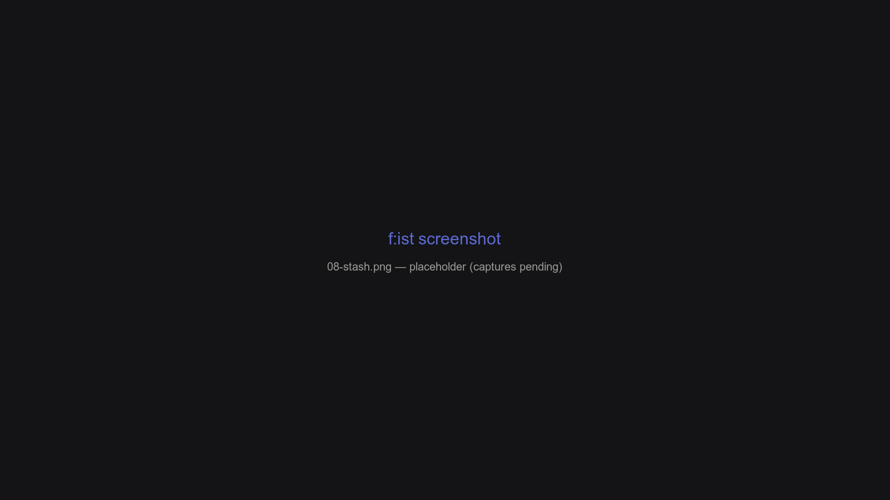

# Stash panes

A **stash** is a named list of paths you curate and reopen as a pane. It's the bookmark shelf of f:ist: push paths in with a key, come back to them whenever you need.



## Overview

- **Push** the current selection to a stash with one key; **open** the stash as a pane with another.
- Stashes are per-name configured: transient (in-memory) or persistent (database), with a policy for duplicate inserts.
- Deleting inside a stash pane removes the *entry*, never the file.

## Pushing and opening

| Keys | Action |
| --- | --- |
| `alt-s` | Push the selection (or cwd) to the **scratch** stash |
| `alt-shift-s` | Open the scratch stash as a pane |
| `alt-b` | Push to the **bookmark** stash |
| `alt-shift-b` | Open the bookmark stash |

`PushStash(name)` adds the selected paths — or the current directory while the cursor is disabled — and stays put. `OpenStash(name)` switches to the stash pane. Inside the pane, `delete` / `shift-delete` remove entries from the stash only; the underlying files are untouched.

## Stash configuration

Each stash name is configured under `[panes.stashes.<name>]` in `config.toml`:

```toml
[panes.stashes.bookmark]
kind = "prune"       # how the pane treats missing paths
insert = "skip"      # what PushStash does to duplicates

[panes.stashes.""]
kind = "transient"   # the unnamed scratch stash
insert = "replace"
```

### `kind`

| Value | Persistence | Missing paths |
| --- | --- | --- |
| `transient` *(default)* | In-memory, empty each run | — |
| `prune` | Database | Deleted while populating |
| `filter` | Database | Hidden |

### `insert`

| Value | Duplicate pushes |
| --- | --- |
| `replace` *(default)* | Re-add, moving the path to the end |
| `skip` | Keep the existing entry |
| `duplicate` | Add a second entry |

## Two common setups

**Scratch** — the unnamed stash is transient by default, so it starts empty on every launch. Good for a throwaway working set.

**Bookmarks** — a named stash with `kind = "prune"` and `insert = "skip"` behaves like permanent references: push a folder you care about, and it persists across sessions.

Undefined stash names fall back to the defaults (with a one-time log warning).

## FAQ

**I deleted a file in a stash pane — is it gone from disk?**

No. Stash entries are references; `delete` in a stash pane removes the entry only.

**Why did my scratch stash lose everything on restart?**

It's `transient` by default — intentionally in-memory. Configure a named stash for persistence.

**What's the difference between a stash and the queue?**

A stash is a list you curate and revisit. The queue holds pending copy/cut operations — see [The queue](queue.md).
